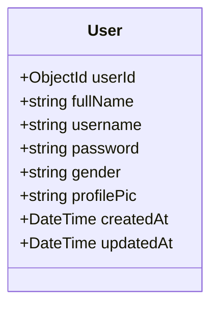
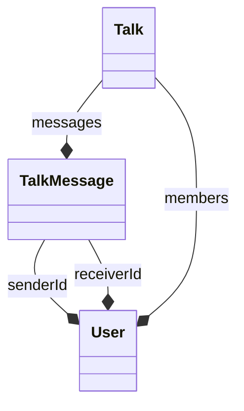
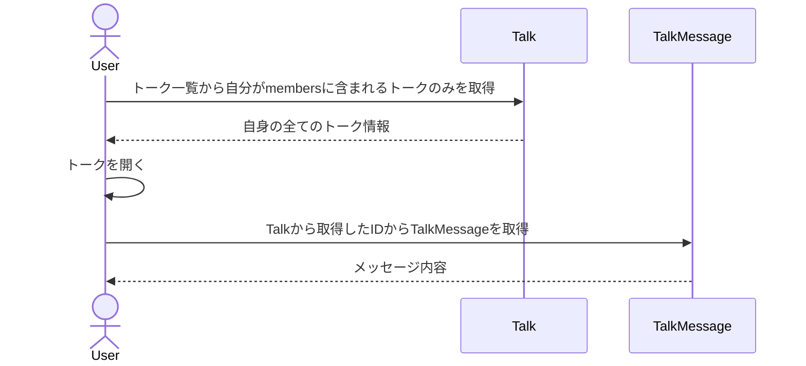
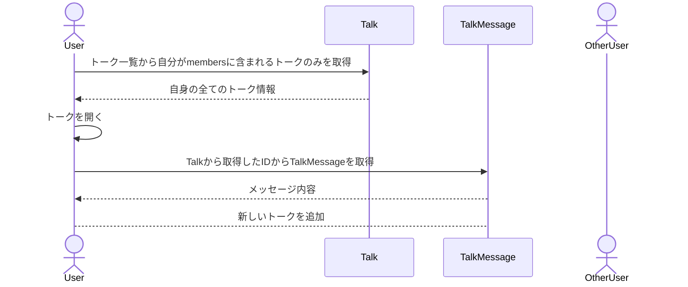
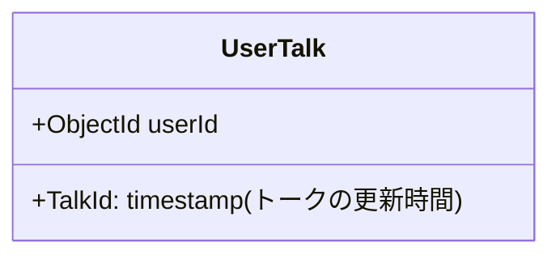
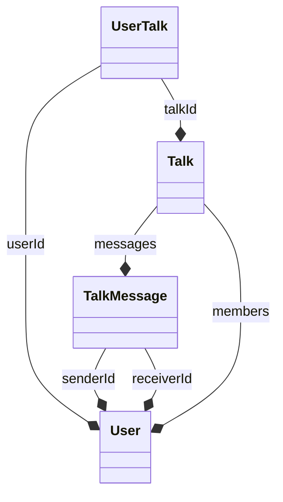
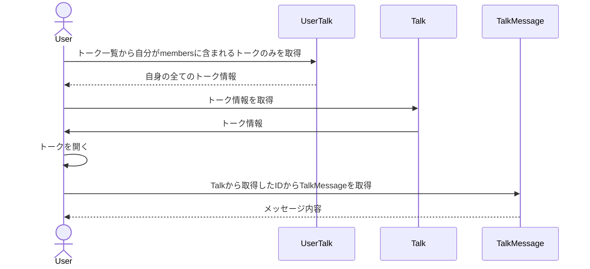
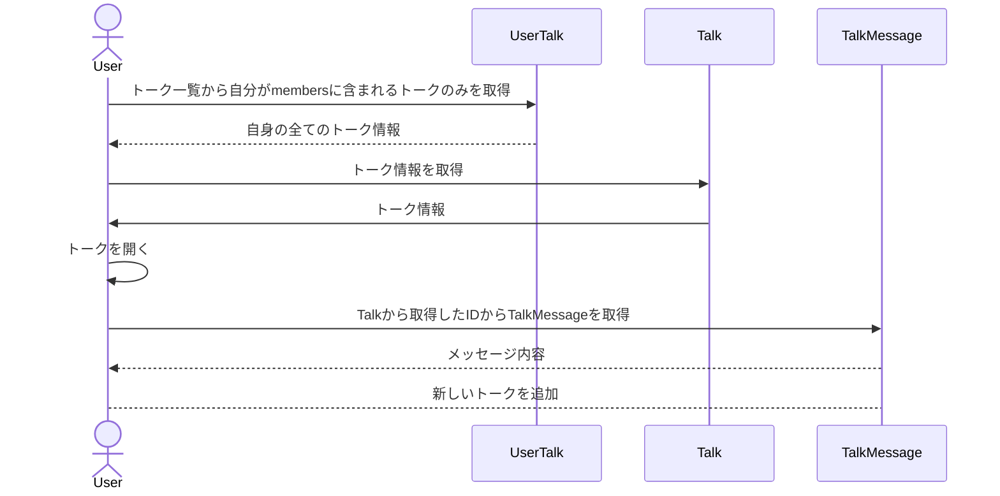

## DB設計案（完成版ではない🙅‍♂️）
### ① UserCollection

### ② TakCollection
```mermaid
classDiagram
    class Talk {
        +ObjectId _id
        +ObjectId[] members
        +ObjectId[] messages
        +Date createdAt
        +Date updatedAt
    }
  ```
### ③ TalkMessageCollection
```mermaid
classDiagram
  class TalkMessage {
      +ObjectId _id
      +ObjectId senderId
      +ObjectId[] reciverId
      +string message 
      +DateTIme time
  }
```

## 関係図



## メッセージの取得


## メッセージの送信


### メモ書き
1. 自身のトークを取得する際に、トーク全部から自身のものだけを取得するのは流石にボトルネックになる気がする


    → UserTalkコレクションを作るかRedisに載せるか

    → トークが消えることはなかなかないからコレクションにして良さそう（ブロックや履歴削除の時だけ）

2. TalkのMembersは誰がトークに参加しているかを管理させる

    → もし、トークに追加した場合はここに入れる

3. TalkMessagesのsenderIdは誰のメッセージかわかるようにするため

    → UsreMessageみたいにユーザーが送信したメッセージを別で管理するのもありか？

    → UserMessageになった場合、ユーザーの数が増えると、複数のコレクションにアクセスする必要があるのでダメだな

4. TalkMessgesのrecievedIdは誰が既読したかを管理

    → 既読は、メッセージごとではなく、一番最後のメッセージを見たら全部既読にする

    → TalkMessagesのデータ毎にreciedIdはいらない

    → TalkかUserTalkかUserTalkSeenに既読情報を分けた方が良いな

    → UserTalkやUserTalkSeenに既読情報を渡すと、トーク内容を取得するときに複数のドキュメントにアクセスする必要が出る

    → Talkに持たせる方がいいかもな

5. ReadMessageコレクションを作るかTalkに既読情報を持たせるか

    → コレクションを分けると、取得の際にアクセスするコレクション増えるので微妙だな

    → コレクションを分けると、データの変更が容易になるくらいしかメリットがないかも


## ✨DB設計（完成版）✨
### ① UserCollection

### ② UserTalk


### ② TakCollection
```mermaid
classDiagram
    class Talk {
        +ObjectId _id
        +ObjectId[] members(既読情報を含む)
        +ObjectId message
        +Date createdAt
        +Date updatedAt
    }
  ```
### ③ TalkMessageCollection
```mermaid
classDiagram
  class TalkMessage {
      +ObjectId _id
      +ObjectId senderId
      +string message 
      +DateTIme time
  }
```

## 関係図



## メッセージの取得


## メッセージの送信

